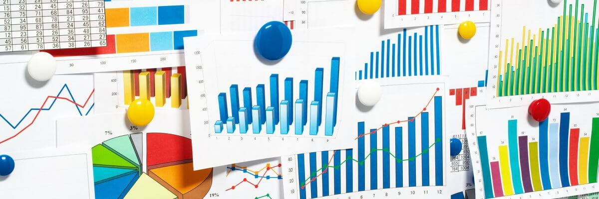
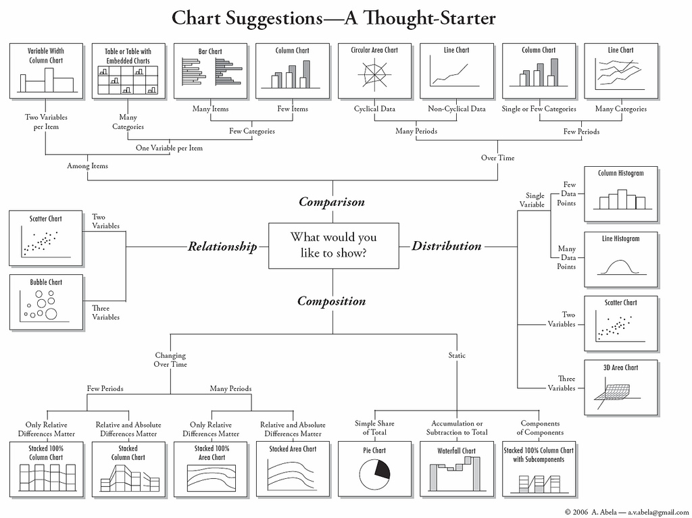
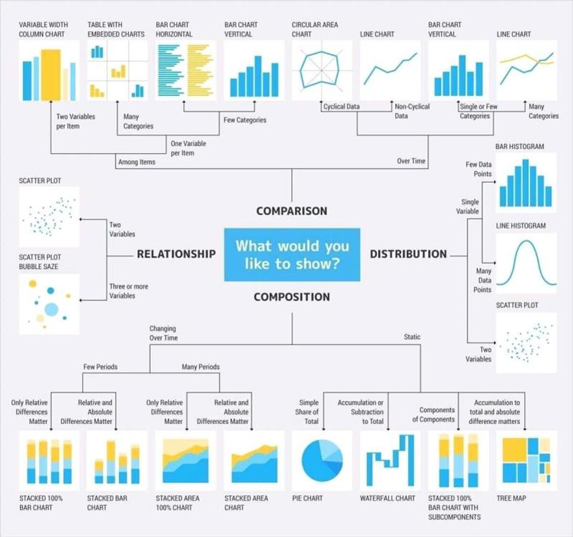

# 1. How to Choose Appropriate Chart

Making sense of facts, numbers, and measurements is a form of art – the art of **data visualization**. To turn your numbers into solid findings, your job is not only to present insights, but also to present it the right way.

### **Basic presentation types** 

There are four basic presentation types that you can use to present your data. Most commonly used types of data analysis: **Comparison and Composition.**

* Comparison
* Composition
* Distribution
* Relationship

> **Numbers have an important story to tell. They rely on you to give them a clear and convincing voice.**  
> ―Stephen Few

### Selecting the Right Chart

Inappropriate visualization could mislead your audience, distort your interpretation, and even undermine your credibility. To determine which chart is best suited for each of those presentation types, you should first understand what information you are  planning to present and why you need a graph.

**Ask yourself a few questions:**

* _Do you want to compare values?_
* _Do you want to show the composition of something?_
* _Do you want to show the trends?_
* _How many variables do you want to show in a single chart? One, two, three, many?_
* _How many items \(data points\) will you display for each variable? Only a few or many?_
* _Will you display values over a period of time, or among items or groups?_

**Bar charts** are good for comparisons, while **line charts** work better for trends. **Scatter plot charts** are good for relationships and distributions, but **pie charts** should be used only for simple compositions — never for comparisons or distributions. 

There is a chart selection diagram that should help you pick the right chart for your data.











