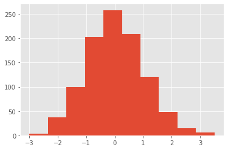
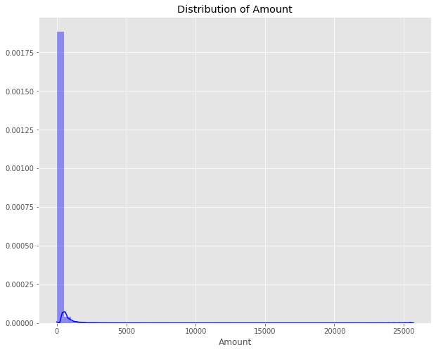

# 1.4 Histogram Plot

**A frequency distribution** shows how often each different value in a set of data occurs. A histogram is the most commonly used graph to show frequency distributions and  can be a great first step in understanding a dataset.

### Normal distribution

```text
data = np.random.randn(1000)
plt.style.use('ggplot')    # customize the chart style
plt.hist(data)
```

### 



### Skewed Distribution

The normal distribution is balance and beautiful. However, In real life, sometimes it does not follow the  law. For example,  in credit card case,  while the vast majority of transactions are very low, this distribution is extremely skewed.



### Histogram Plot

Let's  use the "tips" dataset  for an example. You can download it [here](https://github.com/mwaskom/seaborn-data/blob/master/tips.csv), or load it via seaborn package. 

```text
import seaborn as sns
tips = sns.load_dataset('tips')
```

If you are the owner of a restaurant, of course you may have a fist of things want to know about your business. For instance,  **how much money can I earn per day?  What price zone  can make my customer happy and also make me happy?** If  you are the waiter  or waitress, of course you care about the very similar question. **How much  tips can I earn per  table?**

```text
plt.rcParams.update({'font.size': 20}) #  customize the font size

# create a subplot includes one row and two columns, the two itmes share y_axis
fig, (ax1, ax2) = plt.subplots(1, 2, sharey = True, figsize = (12,6))

ax1.hist(df.tip,color ='c',alpha =0.5) # customize color
ax1.set_title('Tips Distribution')     # set title separately

ax2.hist(df.total_bill,color = 'b',alpha =0.5)
ax2.set_title('Bills Distribution')

ax1.set_ylabel('Frequency')          # set the y_axis name
ax1.set_xlabel('USD')             # set the x_axis name

```


With the histogram plot, questions can be answered easily. A waiter/waitress may earn 2 - 4 dollar per table, sometime you may have good luck to earn 6 dollar a table. While the restaurant's price is very customer friendly, a nice meal only costs 15 - 25 dollar.

