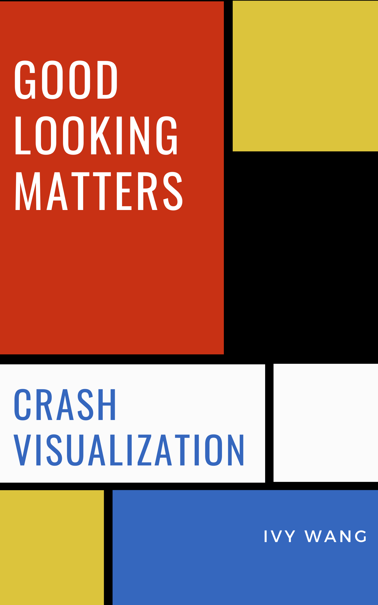

# Welcome

## Crash Visualization

_Ivy  Wang_

_June, 2020_

\_\_

**Visualization** is a powerful tool for telling a story about a data set or analysis. If done correctly, visualization not only displays data but also help the audience digest key information.

**Bad communication is everywhere.** We are not ****naturally good at dealing with data or representing. It's just like other knowledge and skills that we obtained during last 20 years. We need to learn how to do  it properly and how to make it better. That  is my intention to  write this book.

My goal is make this book as helpful and user-friendly as possible. Any feedback is  welcome and appreciated. [ivy.w@veccoinsight.com](mailto:ivy.w@veccoinsight.com)

\_\_

\_\_

\_\_

\_\_

\_\_

